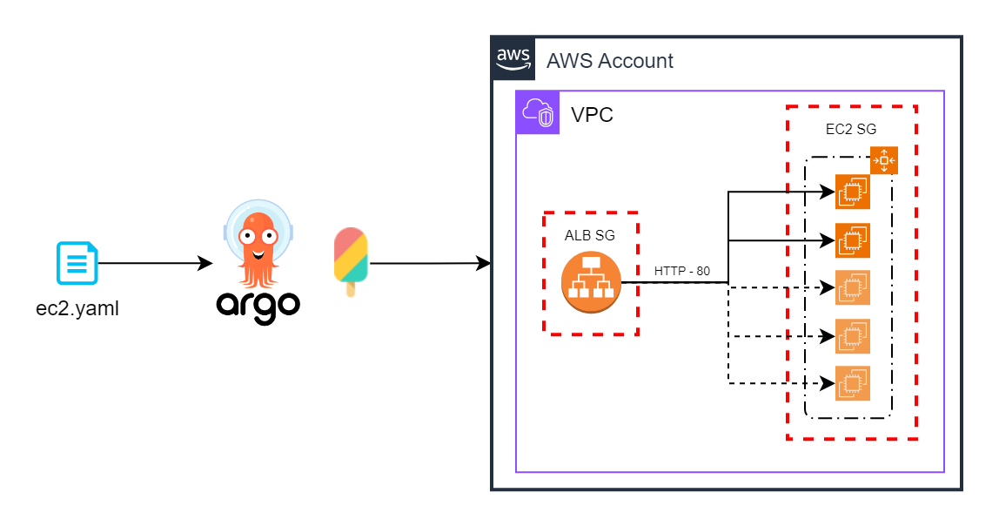

# Ec2 default example
This is a simple infrastructure example that uses ec2, ALB and ASG to demostrate a simple Load Balanced Webpage backed with scaling ec2 instances.

Infrastructure:
- Custom VPC and subnets on eu-west-3
- ALB with its own SG
- EC2 LaunchTemplate
- EC2 LaunchConfiguration with instance specs and userData with SG
- EC2 AutoScaling Group with LauchConfiguration
- ALB Target Group pointing to the ASG

